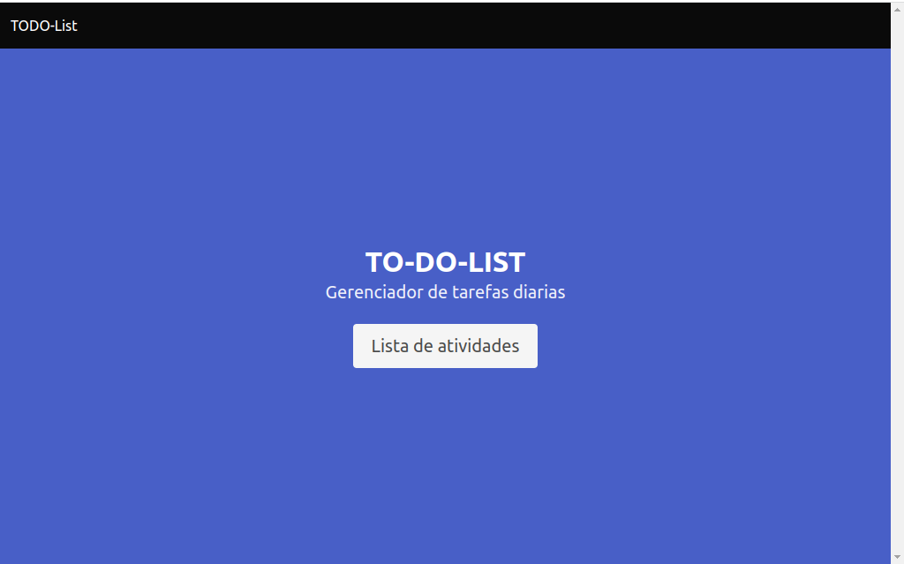
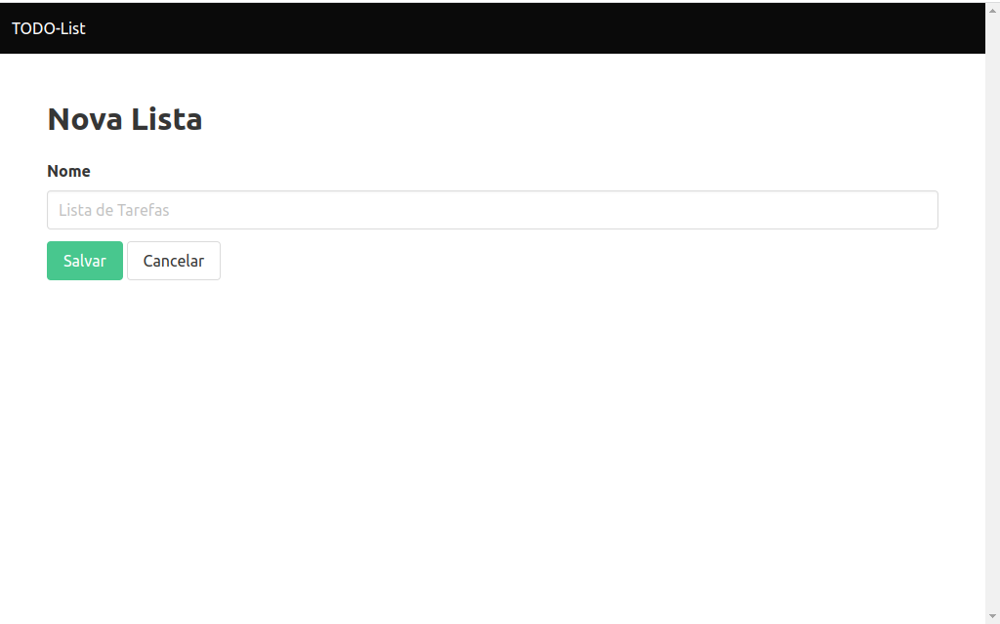
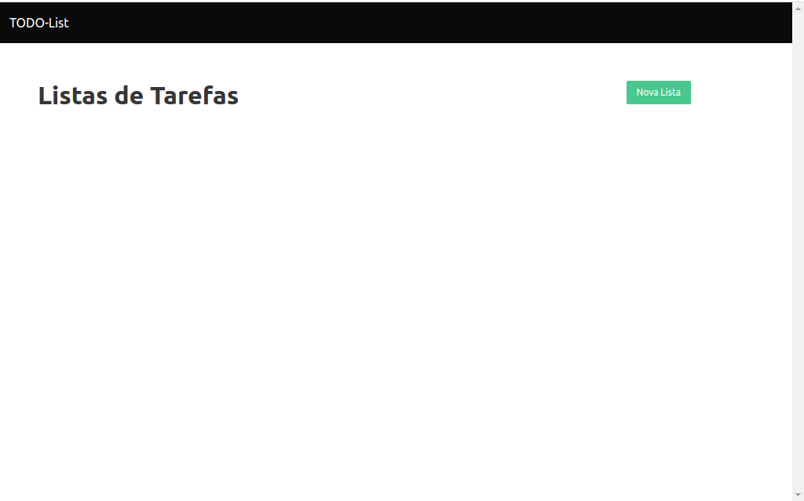
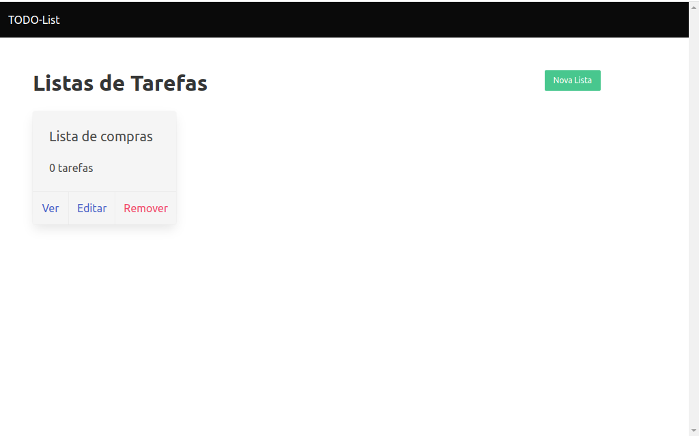
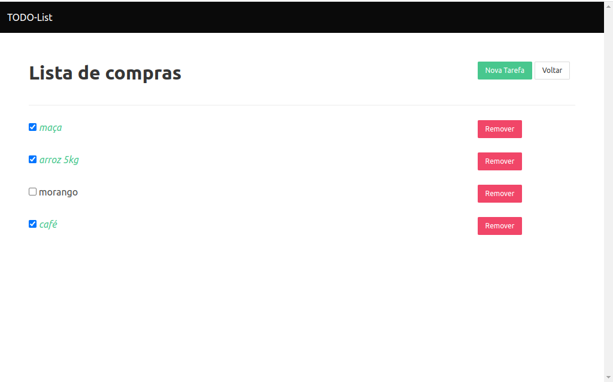

<h1>Bem vindo ao meu aplicativo de criação de notas e tarefas, feito com NODE.js.</h1>

[Link para o site na HEROKU](https://to-do-list-castro.herokuapp.com/)

<section>
    <h2>Objetivo</h2>
        
Esse projeto tem como objetivo aplicar os conhecimnentos adquiridos nas aulas de node.js da OnebitCode.

</section>

<section>
    <h2>Tecnologias Utilizadas</h2>
        <ul>
            <li>Node.js</li>
            <li>Express</li>
            <li>MongoDB</li>
            <li>EJS</li>
        </ul>
</section>   

<kbd>
<section>
    <h2>Imagens do aplicativo</h2>
    
    
    
    
    
</section>
</kbd>

<section>
    <h2>O Aplicativo</h2>
    
Nesse projeto, o proposito é fazer um aplicativo utilizando apenas o back-end, utilizando as ferramentas do express e integrando com o banco de dados MONGODB.

    
O projeto se apoia em um CRUD(Create, Read, Update, Delete), com as rotas feitas em Express, e a API armazenada no banco de dados MONGODE Atlas.

</section>
